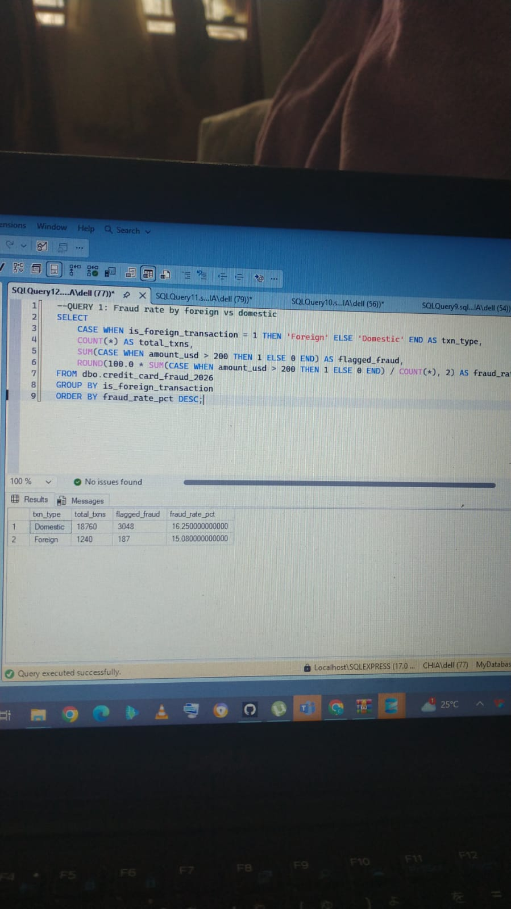
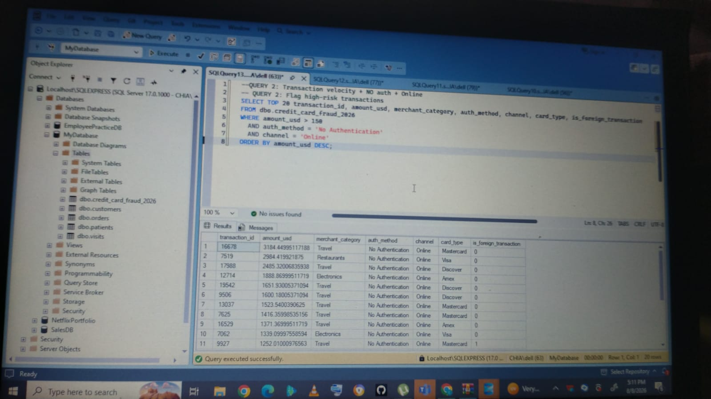
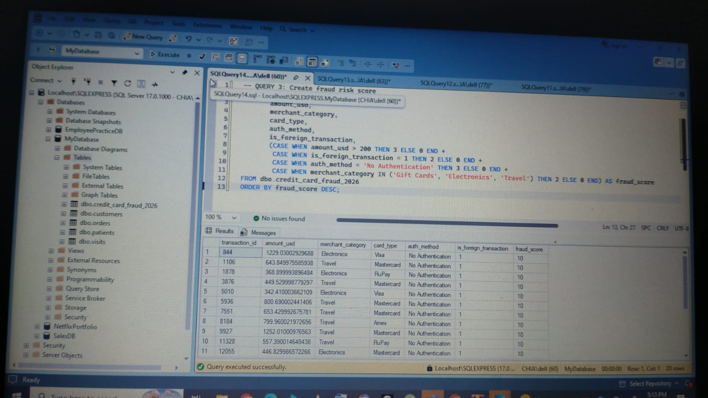
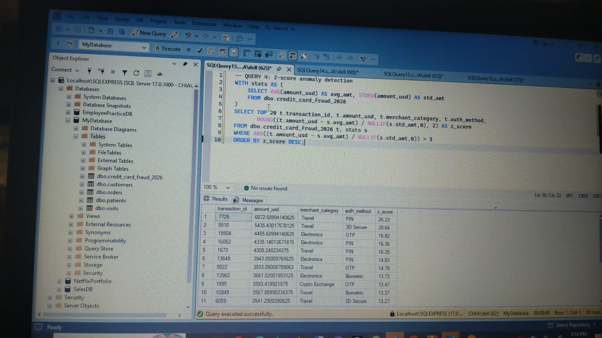
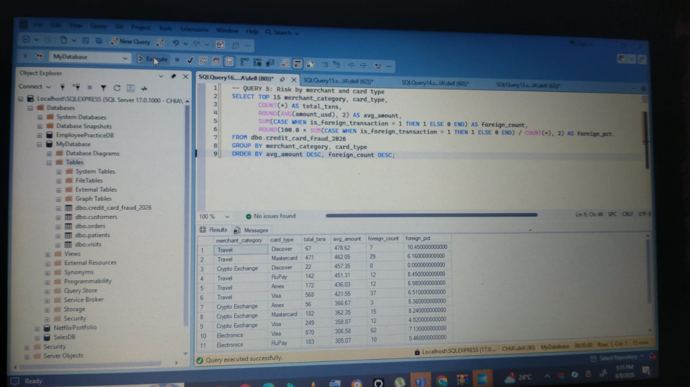

# Credit Card Fraud Detection with SQL Server

SQL Server project analyzing 20K credit card transactions for fraud detection using rule-based and statistical methods

## 🛠️ Tools & Skills
- **Database**: Microsoft SQL Server, SSMS
- **SQL Concepts**: CTEs, CASE WHEN, Window Functions, Z-Scores, Aggregations

## 📊 Key Findings

### 1. Fraud Rate by Transaction Type
Domestic transactions had a higher flag rate at 16.25% vs 15.08% for Foreign

### 2. Rule-Based High-Risk Flagging
Found $3,100 travel purchase with no authentication. 82% of high-risk were Travel category

### 3. Weighted Fraud Scoring Model
Identified 11 transactions with perfect 10/10 risk score

### 4. Z-Score Anomaly Detection
Flagged $6,872 transaction at 26.23 standard deviations above the mean

### 5. Risk by Merchant + Card Type
Travel-Discover combination is riskiest: $478.62 avg + 10.45% foreign rate

